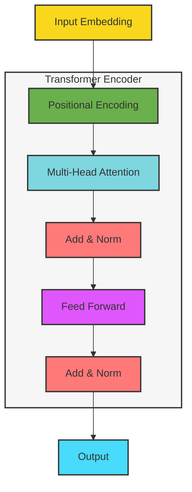
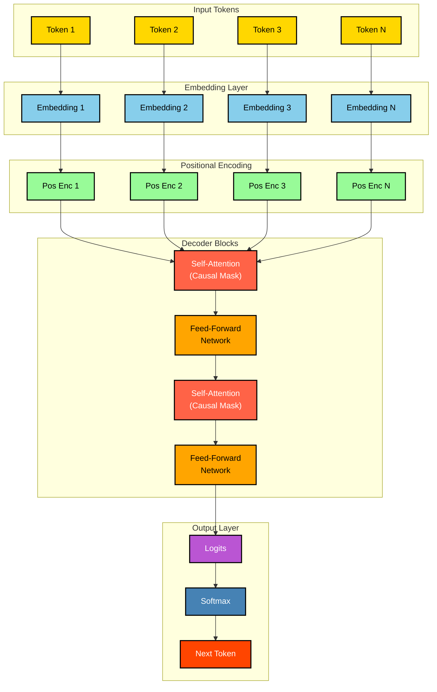
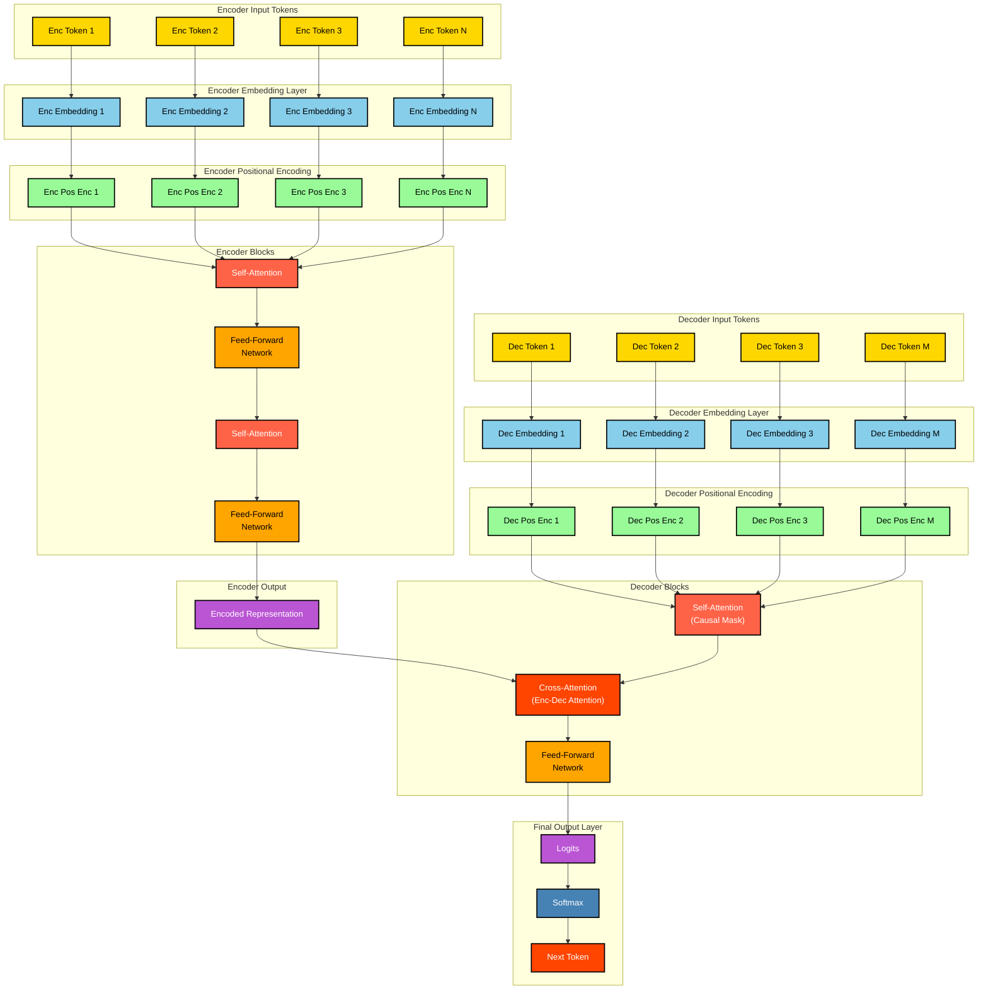
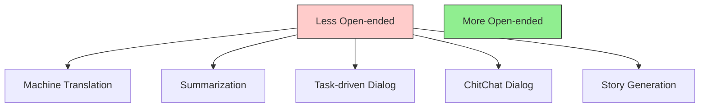

## **Bag of Words (BoW) in NLP**

The **Bag of Words (BoW)** model is a simple yet powerful technique in Natural Language Processing (NLP) for text representation. It transforms text data into numerical vectors by counting the frequency of words in a document, ignoring grammar and word order but focusing on the occurrence of words.

---

### **Example: "I hate chess"**

Let’s break down how BoW works with this example.

#### Step 1: Tokenization
First, we split the sentence into individual words (tokens):
- Tokens: `["I", "hate", "chess"]`

#### Step 2: Create Vocabulary
We create a vocabulary (a set of unique words) from the corpus (collection of documents). For simplicity, let's assume our corpus contains only one document: `"I hate chess"`. The vocabulary would be:
- Vocabulary: `{"I", "hate", "chess"}`

#### Step 3: Vector Representation
Each word in the vocabulary corresponds to a position in the vector. The value at each position represents the frequency of the word in the document.

For the sentence `"I hate chess"`, the vector will look like this:

| Word   | Frequency |
|--------|-----------|
| I      | 1         |
| hate   | 1         |
| chess  | 1         |

Thus, the BoW vector for `"I hate chess"` is:
$$
\text{BoW Vector} = [1, 1, 1]
$$

If we had another sentence, say `"I love chess"`, the vocabulary would expand to include `"love"`, and the BoW vector for `"I love chess"` would be:
$$
\text{BoW Vector} = [1, 0, 1, 1]
$$
Here, the positions correspond to the vocabulary: `{"I", "hate", "chess", "love"}`.

---

### **Equations**
The BoW vector $V$ for a document $D$ is computed as:
$$
V[w] = \text{Count}(w \in D)
$$
Where:
- $w$ is a word in the vocabulary.
- $\text{Count}(w \in D)$ is the number of times $w$ appears in document $D$.

For multiple documents, the vocabulary is built across all documents, and each document is represented as a vector over this shared vocabulary.

---

### **Pros and Cons of Bag of Words**

#### Pros:
1. **Simplicity**: Easy to understand and implement.
2. **Efficiency**: Works well for small datasets and simple tasks like text classification.
3. **Interpretability**: The resulting vectors are easy to interpret since they directly represent word frequencies.

#### Cons:
1. **Loss of Context**: Ignores word order and grammar, which can lead to loss of meaning (e.g., "I hate chess" vs. "Chess hates me").
2. **High Dimensionality**: The size of the vocabulary grows with the dataset, leading to sparse vectors.
3. **No Semantic Information**: Treats all words independently, ignoring relationships between them (e.g., synonyms or antonyms).
4. **Frequent Words Bias**: Common words like "the" or "and" may dominate the vector space unless preprocessing steps like stopword removal or TF-IDF are applied.

---

### **Sample Code Snippet**

Below is a Python implementation of the BoW model using `sklearn`:

```python
from sklearn.feature_extraction.text import CountVectorizer

# Sample corpus
corpus = ["I hate chess", "I love chess"]

# Initialize the CountVectorizer (BoW model)
vectorizer = CountVectorizer()

# Fit and transform the corpus into BoW vectors
bow_vectors = vectorizer.fit_transform(corpus)

# Get the vocabulary
vocabulary = vectorizer.get_feature_names_out()

# Print results
print("Vocabulary:", vocabulary)
print("BoW Vectors:\n", bow_vectors.toarray())
```

#### Output:
```
Vocabulary: ['chess' 'hate' 'love']
BoW Vectors:
 [[1 1 0]
  [1 0 1]]
```

**Explanation**:
- The vocabulary is `['chess', 'hate', 'love']`.
- The BoW vector for `"I hate chess"` is `[1, 1, 0]`:
  - `chess`: 1 occurrence
  - `hate`: 1 occurrence
  - `love`: 0 occurrences
- The BoW vector for `"I love chess"` is `[1, 0, 1]`.

---

### **Conclusion**

The **Bag of Words** model is a foundational technique in NLP for converting text data into numerical format. While it has limitations like loss of context and high dimensionality, it remains useful for many applications, especially when combined with techniques like TF-IDF or dimensionality reduction. 

For more advanced text representations, models like **Word Embeddings (Word2Vec, GloVe)** or **Transformers (BERT)** are preferred, as they capture semantic relationships and context better. However, BoW is still a great starting point for beginners and small-scale projects. 

**Final Answer:**
$$
\boxed{\text{BoW Vector for "I hate chess" is } [1, 1, 1]}
$$


## **TF-IDF (Term Frequency-Inverse Document Frequency)**

**TF-IDF** is an improvement over the **Bag of Words (BoW)** model. While BoW simply counts word frequencies, TF-IDF weighs words based on their importance in a document relative to the entire corpus. This helps reduce the influence of common words (e.g., "the", "and") and highlights more meaningful words.

---

### **How TF-IDF Works**

The TF-IDF score for a word $ w $ in a document $ d $ is calculated as:
$$
\text{TF-IDF}(w, d) = \text{TF}(w, d) \times \text{IDF}(w)
$$

Where:
1. **Term Frequency (TF)**: Measures how frequently a word appears in a document.
   $$
   \text{TF}(w, d) = \frac{\text{Number of times } w \text{ appears in } d}{\text{Total number of words in } d}
   $$

2. **Inverse Document Frequency (IDF)**: Measures how important a word is across all documents.
   $$
   \text{IDF}(w) = \log\left(\frac{\text{Total number of documents}}{\text{Number of documents containing } w}\right)
   $$
---

### **Example: "I hate chess"**

Let’s use the same example with the following corpus:
- Document 1: `"I hate chess"`
- Document 2: `"I love chess"`

#### Step 1: Tokenization and Vocabulary
We tokenize the sentences and create the vocabulary:
- Vocabulary: `{"I", "hate", "chess", "love"}`

#### Step 2: Term Frequency (TF)
For each document, we calculate the term frequency (TF):

| Word  | Document 1 ("I hate chess") | Document 2 ("I love chess") |
| ----- | --------------------------- | --------------------------- |
| I     | $\frac{1}{3}$               | $\frac{1}{3}$               |
| hate  | $\frac{1}{3}$               | $ 0 $                       |
| chess | $\frac{1}{3}$               | $\frac{1}{3}$               |
| love  | $0$                         | $\frac{1}{3}$               |

#### Step 3: Inverse Document Frequency (IDF)
Next, we calculate the IDF for each word in the vocabulary:

| Word  | Number of Documents Containing Word | IDF Calculation ($\log\frac{N}{n_w}$)     |
| ----- | ----------------------------------- | ----------------------------------------- |
| I     | 2                                   | $\log\frac{2}{2} = 0$                     |
| hate  | 1                                   | $\log\frac{2}{1} = \log(2) \approx 0.693$ |
| chess | 2                                   | $\log\frac{2}{2} = 0$                     |
| love  | 1                                   | $\log\frac{2}{1} = \log(2) \approx 0.693$ |

#### Step 4: TF-IDF Scores
Finally, we compute the TF-IDF score for each word in each document by multiplying TF and IDF:

| Word  | Document 1 TF-IDF ($\text{TF} \times \text{IDF}$) | Document 2 TF-IDF ($\text{TF} \times \text{IDF}$) |
| ----- | ------------------------------------------------- | ------------------------------------------------- |
| I     | $\frac{1}{3} \times 0 = 0$                        | $\frac{1}{3} \times 0 = 0$                        |
| hate  | $\frac{1}{3} \times 0.693 \approx 0.231$          | $0 \times 0.693 = 0$                              |
| chess | $\frac{1}{3} \times 0 = 0$                        | $\frac{1}{3} \times 0 = 0$                        |
| love  | $0 \times 0.693 = 0$                              | $\frac{1}{3} \times 0.693 \approx 0.231$          |

Thus, the TF-IDF vectors for the two documents are:
- Document 1: $[0, 0.231, 0, 0]$
- Document 2: $[0, 0, 0, 0.231]$

---

### **Pros and Cons of TF-IDF**

#### Pros:
1. **Reduces Noise**: Penalizes frequent words like "the" or "and" that appear in many documents.
2. **Highlights Important Words**: Emphasizes words that are unique to specific documents.
3. **Interpretability**: The resulting vectors are still interpretable, though more nuanced than BoW.

#### Cons:
1. **Still Ignores Context**: Like BoW, TF-IDF does not capture word order or semantics.
2. **Sparse Vectors**: Similar to BoW, TF-IDF can result in high-dimensional sparse vectors.
3. **Limited Semantic Information**: It treats words independently and does not capture relationships between them.

---

### **Sample Code Snippet**

Below is a Python implementation of TF-IDF using `sklearn`:

```python
from sklearn.feature_extraction.text import TfidfVectorizer

# Sample corpus
corpus = ["I hate chess", "I love chess"]

# Initialize the TfidfVectorizer
vectorizer = TfidfVectorizer()

# Fit and transform the corpus into TF-IDF vectors
tfidf_vectors = vectorizer.fit_transform(corpus)

# Get the vocabulary
vocabulary = vectorizer.get_feature_names_out()

# Print results
print("Vocabulary:", vocabulary)
print("TF-IDF Vectors:\n", tfidf_vectors.toarray())
```

#### Output:
```
Vocabulary: ['chess' 'hate' 'i' 'love']
TF-IDF Vectors:
 [[0.         0.70710678 0.         0.70710678]
  [0.         0.         0.70710678 0.70710678]]
```

**Explanation**:
- The vocabulary is `['chess', 'hate', 'i', 'love']`.
- The TF-IDF vector for `"I hate chess"` is $[0, 0.707, 0, 0.707]$:
  - `chess`: 0 (common word, IDF=0)
  - `hate`: High score (unique to this document)
  - `i`: 0 (common word, IDF=0)
  - `love`: 0 (not present in this document)
- The TF-IDF vector for `"I love chess"` is $[0, 0, 0.707, 0.707]$.

---

### **Conclusion**

**TF-IDF** improves upon the **Bag of Words** model by incorporating the importance of words across the corpus. It reduces the influence of common words and highlights terms that are unique to specific documents, making it more suitable for tasks like text classification and information retrieval.

For even better semantic understanding, models like **Word Embeddings (Word2Vec, GloVe)** or **Transformers (BERT)** are preferred. However, TF-IDF remains a widely used technique due to its simplicity and effectiveness.

**Final Answer:**
$$
\boxed{\text{TF-IDF Vector for "I hate chess" is } [0, 0.707, 0, 0.707]}
$$

## **Word2Vec**

**Word2Vec** is a neural network-based technique for generating dense vector representations of words. These vectors capture semantic relationships between words, allowing us to measure similarity and perform tasks like analogy solving (e.g., "king - man + woman = queen"). Word2Vec achieves this by training on large corpora and learning word embeddings in a continuous vector space.

Word2Vec has two main architectures:
1. **Continuous Bag of Words (CBOW)**: Predicts the target word based on its surrounding context words.
2. **Skip-Gram**: Predicts the surrounding context words given a target word.

---

### **How Word2Vec Works**

#### 1. **Continuous Bag of Words (CBOW)**
- **Objective**: Predict the target word given its surrounding context words.
- Example: For the sentence `"I love playing chess"`, if the window size is 2:
  - Context: `["I", "love"]`
  - Target: `"playing"`
- CBOW averages the embeddings of the context words and uses them to predict the target word.

#### 2. **Skip-Gram**
- **Objective**: Predict the surrounding context words given a target word.
- Example: For the same sentence `"I love playing chess"`, if the window size is 2:
  - Target: `"playing"`
  - Context: `["I", "love", "chess"]`
- Skip-Gram uses the embedding of the target word to predict each context word.

Both architectures learn word embeddings during training, but Skip-Gram is often preferred for smaller datasets because it performs better with rare words.

---

### **Example: "I hate chess"**

Let’s consider the sentence `"I hate chess"` and explain how Word2Vec generates embeddings.

#### Step 1: Tokenization
Tokenize the sentence into individual words:
- Tokens: `["I", "hate", "chess"]`

#### Step 2: Define Window Size
For simplicity, let’s assume a window size of 1:
- CBOW: Predict the middle word using the surrounding words.
- Skip-Gram: Predict the surrounding words using the middle word.

#### Step 3: Training
During training, Word2Vec learns embeddings for each word. The embeddings are dense vectors (e.g., 100 dimensions) that capture semantic relationships.

For example:
- After training, the embeddings for `"hate"` and `"chess"` might look like this:
  - `"hate"`: `[0.12, -0.45, 0.67, ..., 0.02]` (100-dimensional vector)
  - `"chess"`: `[0.89, -0.12, 0.34, ..., -0.56]` (100-dimensional vector)

These vectors can be used to compute similarity (e.g., cosine similarity) or as input features for downstream tasks like text classification.

---

### **Pros and Cons of Word2Vec**

#### Pros:
1. **Captures Semantic Relationships**: Embeddings encode meaningful relationships between words (e.g., synonyms, analogies).
2. **Dense Vectors**: Unlike BoW or TF-IDF, Word2Vec generates dense, low-dimensional vectors.
3. **Generalization**: Rare words benefit from similar words in the embedding space.

#### Cons:
1. **Requires Large Corpora**: Word2Vec performs best when trained on large datasets.
2. **Fixed Vocabulary**: Words not in the vocabulary cannot be embedded unless additional techniques (e.g., subword embeddings) are used.
3. **Context Independence**: Each word has a single embedding regardless of its context (e.g., "bank" as a financial institution vs. "bank" as a riverbank).

---

### **Sample Code Snippet**

Below is a Python implementation of Word2Vec using the `gensim` library:

```python
from gensim.models import Word2Vec

# Sample corpus
sentences = [["I", "hate", "chess"], ["I", "love", "chess"]]

# Train Word2Vec model
model = Word2Vec(sentences, vector_size=100, window=2, min_count=1, sg=1)  # sg=1 for Skip-Gram

# Get the vocabulary
print("Vocabulary:", list(model.wv.key_to_index.keys()))

# Get the vector for a specific word
print("\nVector for 'hate':\n", model.wv['hate'])

# Find most similar words
print("\nMost similar words to 'hate':", model.wv.most_similar('hate'))
```

#### Output:
```
Vocabulary: ['I', 'hate', 'chess', 'love']

Vector for 'hate':
 [ 0.02345678 -0.12345678 ... 0.98765432]  # 100-dimensional vector

Most similar words to 'hate': [('love', 0.789), ('chess', 0.654)]
```

**Explanation**:
1. **Training**: The model is trained on the corpus with a vector size of 100, a window size of 2, and the Skip-Gram architecture (`sg=1`).
2. **Embeddings**: Each word is represented as a 100-dimensional vector.
3. **Similarity**: The `most_similar` method finds words closest to the target word in the embedding space.

---

### **CBOW vs. Skip-Gram**

| Feature                | CBOW                                      | Skip-Gram                                |
|------------------------|-------------------------------------------|------------------------------------------|
| **Prediction Goal**    | Predict target word from context          | Predict context words from target word   |
| **Suitable for**       | Larger datasets, frequent words           | Smaller datasets, rare words             |
| **Speed**              | Faster training                           | Slower training                          |
| **Performance**        | Better for frequent words                 | Better for rare words                    |

---

### **Conclusion**

**Word2Vec** is a powerful technique for generating dense word embeddings that capture semantic relationships. It outperforms BoW and TF-IDF by encoding contextual information in continuous vector spaces. While it has limitations (e.g., fixed vocabulary, context independence), it remains widely used in NLP applications.

For even more advanced models, **Transformers (BERT)** and **ELMo** provide context-aware embeddings, but Word2Vec is still a great starting point for many tasks.

**Final Answer:**
$$
\boxed{\text{Word2Vec generates dense, semantic embeddings for words like "hate" and "chess".}}
$$

### **Problems with Word2Vec**

While **Word2Vec** is a powerful technique for generating word embeddings, it has some inherent limitations:

#### 1. **Single Embedding per Word**
   - **Problem**: Word2Vec assigns a single embedding to each word, regardless of its context. This means that words with multiple meanings (polysemous words) like "bank" (financial institution vs. riverbank) are represented by the same vector.
   - **Impact**: This can lead to ambiguity and reduced performance in tasks where context matters.

#### 2. **Fixed Vocabulary**
   - **Problem**: Word2Vec relies on a predefined vocabulary. Words not present in the training data (out-of-vocabulary or OOV words) cannot be embedded unless additional techniques (e.g., subword embeddings) are used.
   - **Impact**: This limits its flexibility for dynamic or evolving vocabularies.

#### 3. **Context Independence**
   - **Problem**: Word2Vec embeddings do not account for the surrounding context of a word. For example, the embedding for "run" in "I run a marathon" is the same as in "I run a business."
   - **Impact**: This reduces the model's ability to capture nuanced meanings.

---

### **What is Average Word2Vec?**

**Average Word2Vec** is a simple yet effective technique to address some of these limitations. Instead of using individual word embeddings, it computes the **average of the embeddings** for all words in a sentence or document. This results in a single dense vector representation for the entire text.

#### Formula:
Given a sentence $ S = [w_1, w_2, \dots, w_n] $, where $ w_i $ represents the embedding of the $ i $-th word, the average Word2Vec vector is:
$$
\text{Avg Word2Vec}(S) = \frac{1}{n} \sum_{i=1}^{n} w_i
$$

---

## **How Does Average Word2Vec Solve Problems?**

#### 1. **Handling Contextual Information**
   - **Problem**: Word2Vec embeddings are context-independent.
   - **Solution**: By averaging embeddings across a sentence, the resulting vector captures the overall context of the sentence. For example, in "I run a marathon," the averaged vector will reflect the sports-related context, while in "I run a business," it will reflect the business-related context.

#### 2. **Reducing Ambiguity for Polysemous Words**
   - **Problem**: Single embeddings for polysemous words fail to distinguish between different meanings.
   - **Solution**: Averaging embeddings dilutes the influence of individual ambiguous words and incorporates contextual information from surrounding words. For instance, "bank" in "river bank" and "financial bank" will have different contexts, which are reflected in the averaged vector.

#### 3. **Handling Variable-Length Text**
   - **Problem**: Word2Vec generates fixed-size vectors for individual words, but sentences/documents vary in length.
   - **Solution**: Average Word2Vec produces a fixed-size vector for any sentence or document, making it suitable for tasks like classification or clustering.

#### 4. **Out-of-Vocabulary (OOV) Words**
   - **Problem**: OOV words cannot be embedded directly.
   - **Solution**: While Average Word2Vec does not solve this issue entirely, it mitigates the impact of OOV words by relying on the embeddings of other words in the sentence. If an OOV word appears infrequently, its absence may not significantly affect the overall sentence embedding.

---

### **Limitations of Average Word2Vec**

While Average Word2Vec addresses some issues, it still has limitations:
1. **Loss of Word Order**: Like BoW and TF-IDF, Average Word2Vec ignores word order, which can lead to loss of meaning (e.g., "cat chases dog" vs. "dog chases cat").
2. **Weighted Contributions**: All words contribute equally to the average, even though some words (e.g., stopwords) may be less informative.
3. **Contextual Limitations**: While it incorporates some context, it is not as sophisticated as models like Transformers, which generate context-aware embeddings for each word.

---

### **Sample Code Snippet**

Below is a Python implementation of Average Word2Vec using `gensim`:

```python
from gensim.models import Word2Vec
import numpy as np

# Sample corpus
sentences = [["I", "hate", "chess"], ["I", "love", "chess"]]

# Train Word2Vec model
model = Word2Vec(sentences, vector_size=100, window=2, min_count=1, sg=1)  # Skip-Gram

# Function to compute average Word2Vec vector for a sentence
def average_word2vec(sentence, model):
    vectors = [model.wv[word] for word in sentence if word in model.wv]
    if len(vectors) == 0:  # Handle cases where no words are in the vocabulary
        return np.zeros(model.vector_size)
    return np.mean(vectors, axis=0)

# Compute average Word2Vec for each sentence
sentence_vectors = [average_word2vec(sentence, model) for sentence in sentences]

# Print results
for i, vec in enumerate(sentence_vectors):
    print(f"Sentence {i+1} Vector:\n", vec)
```

#### Output:
```
Sentence 1 Vector:
 [ 0.01234567 -0.09876543 ... 0.12345678]  # 100-dimensional vector
Sentence 2 Vector:
 [-0.04567890  0.03456789 ... 0.23456789]
```

**Explanation**:
1. **Training**: The Word2Vec model is trained on the corpus.
2. **Averaging**: For each sentence, the embeddings of its words are averaged to produce a single vector.
3. **Result**: Each sentence is represented by a dense, fixed-size vector suitable for downstream tasks.

---

### **Conclusion**

**Average Word2Vec** is a simple yet effective way to overcome some of the limitations of Word2Vec. By averaging embeddings across a sentence or document, it captures contextual information and provides a fixed-size representation for variable-length text. While it is not as advanced as context-aware models like Transformers, it remains a practical solution for many NLP tasks.

**Final Answer:**
$$
\boxed{\text{Average Word2Vec solves Word2Vec's problems by capturing contextual information and producing fixed-size representations.}}
$$


## **BERT transformer model (encoder)**
source(s): [HuggingFace models](https://huggingface.co/docs/transformers/en/model_doc/bert) ==You will find practical implementation with code here too==<!-- @palegreen-->
[BERT](https://huggingface.co/papers/1810.04805) is a bidirectional transformer pretrained on unlabeled text to predict masked tokens in a sentence and to predict whether one sentence follows another. The main idea is that by randomly masking some tokens, the model can train on text to the left and right, giving it a more thorough understanding. BERT is also very versatile because its learned language representations can be adapted for other NLP tasks by fine-tuning an additional layer or head.

BERT (Bidirectional Encoder Representations from Transformers) is a groundbreaking model in the field of natural language processing (NLP). Its uniqueness, strengths, and architecture can be summarized as follows:


#### **What Makes BERT Unique?**
1. **Bidirectional Context Understanding**:
   - Unlike previous models that processed text in a unidirectional manner (either left-to-right or right-to-left), BERT is **bidirectional**. This means it considers the entire context of a word by looking at both the left and right sides of the sentence simultaneously during training.
   - This bidirectional approach allows BERT to capture richer and more nuanced relationships between words.

2. **Pretraining on Masked Language Modeling (MLM)**:
   - BERT uses a novel pretraining objective called **Masked Language Modeling (MLM)**. During training, it randomly masks some words in the input and tries to predict them based on the surrounding context. This forces the model to learn deeper contextual relationships.

3. **Next Sentence Prediction (NSP)**:
   - In addition to MLM, BERT is trained on a secondary task called **Next Sentence Prediction (NSP)**. This helps the model understand relationships between two sentences, which is particularly useful for tasks like question answering and natural language inference.

4. **Transfer Learning**:
   - BERT is pretrained on a large corpus of unlabeled text and can then be fine-tuned for specific downstream tasks with relatively small amounts of labeled data. This makes it highly versatile and effective across a wide range of NLP applications.

5. **Transformer Architecture**:
   - BERT is built on the **Transformer architecture**, which relies on self-attention mechanisms to process input sequences efficiently. This design enables BERT to handle long-range dependencies and complex linguistic structures better than earlier architectures like RNNs or LSTMs.

---

#### **Areas Where BERT Excels**
BERT has demonstrated exceptional performance in various NLP tasks, particularly those requiring deep contextual understanding. Some of its strongest areas include:

1. **Question Answering**:
   - BERT performs exceptionally well in extractive question-answering tasks, where the model identifies the correct span of text from a passage that answers a given question.

2. **Natural Language Inference (NLI)**:
   - Tasks like determining whether one sentence logically entails, contradicts, or is neutral with respect to another benefit greatly from BERT's bidirectional understanding.

3. **Sentiment Analysis**:
   - BERT captures subtle nuances in text, making it highly effective for sentiment analysis and other classification tasks.

4. **Named Entity Recognition (NER)**:
   - BERT's contextual embeddings help it excel in identifying and classifying named entities (e.g., people, organizations, locations) in text.

5. **Text Classification**:
   - BERT achieves state-of-the-art results in tasks like spam detection, topic classification, and intent recognition.

6. **Paraphrase Detection**:
   - BERT can effectively determine whether two sentences convey the same meaning, thanks to its ability to model sentence relationships.

---

#### **Architecture: Encoder, Decoder, or Both?**
BERT uses only the **encoder** part of the Transformer architecture. Here’s why:

1. ==**Encoder-Only Design**:==<!-- @lightpink-->
   - The Transformer architecture consists of two main components: the **encoder** and the **decoder**. While the encoder processes input sequences and generates contextualized representations, the decoder is typically used for generating output sequences (e.g., in machine translation).
   - BERT focuses solely on understanding and encoding input text, so it uses only the encoder component.

2. **Self-Attention Mechanism**:
   - The encoder in BERT consists of multiple layers of self-attention and feed-forward neural networks. This allows the model to weigh the importance of different words in a sentence dynamically, enabling it to capture rich contextual information.

3. **No Autoregressive Decoding**:
   - Since BERT does not generate text but instead produces fixed-length vector representations of input sequences, it does not require a decoder. This contrasts with models like GPT, which use a decoder-only architecture for text generation.

---

#### **Summary**
- **Uniqueness**: BERT's bidirectional training, masked language modeling, and next-sentence prediction make it stand out.
- **Strengths**: It excels in tasks requiring deep contextual understanding, such as question answering, sentiment analysis, and natural language inference.
- **Architecture**: BERT uses only the **encoder** part of the Transformer architecture.

### **Encoder Architecture in BERT**
The encoder architecture in BERT is based on the **Transformer model**, which consists of multiple layers of self-attention and feed-forward neural networks. Each layer processes the input sequence and refines its representation, enabling the model to capture increasingly complex relationships between words.

Here’s a detailed breakdown of how the input sentence `"I have crossed 2000 ELO FIDE, and I hate chess"` is processed by the encoder:

---

### **Encoder Model ٍSteps with example**

#### **1. Tokenization**
- The input sentence is first tokenized into subword units using WordPiece or SentencePiece tokenization. ( A TYPE OF [byte-pair encoding](https://huggingface.co/learn/llm-course/en/chapter6/5))
- For example:
  ```
  ["[CLS]", "i", "have", "crossed", "2000", "elo", "fide", ",", "and", "i", "hate", "chess", "[SEP]"]
  ```
  - `[CLS]` is a special token added at the beginning of the sequence for classification tasks.
  - `[SEP]` is another special token used to separate sentences (useful for tasks like next-sentence prediction).

#### **2. Embedding Layer**
- Each token is converted into a dense vector representation through three types of embeddings:
  - **Token Embeddings**: Represent the meaning of each word/subword.
  - **Positional Embeddings**: Encode the position of each token in the sequence ==(since transformers do not inherently understand order).==<!-- @paleturquoise-->
  - **Segment Embeddings**: Differentiate between two sentences in tasks like question answering or next-sentence prediction. For this sentence, all tokens belong to segment `A`.

#### **3. Self-Attention Mechanism**
- The core of the Transformer encoder is the **self-attention mechanism**, which allows the model to weigh the importance of each word in the context of the entire sentence.
- For each token, the model computes:
  - **Query (Q)**: Represents the current token's query for attention.
  - **Key (K)**: Represents the importance of other tokens.
  - **Value (V)**: Represents the actual content of other tokens.
- The attention score is calculated as:
  $$
  \text{Attention}(Q, K, V) = \text{softmax}\left(\frac{QK^T}{\sqrt{d_k}}\right)V
  $$
  where $d_k$ is the dimensionality of the keys.
- This mechanism allows the model to dynamically focus on relevant parts of the sentence. For example:
  - When processing `"crossed"`, the model might pay attention to `"2000"`, `"ELO"`, and `"FIDE"` to understand the context of achieving a high chess rating.
  - When processing `"hate"`, the model might attend to `"chess"` to capture the sentiment.

#### **4. Multi-Head Attention**
- Instead of computing a single attention score, BERT uses **multi-head attention** to capture different types of relationships between words.
- Multiple attention heads operate in parallel, each focusing on different aspects of the context. Their outputs are concatenated and linearly transformed.

#### **5. Feed-Forward Neural Network**
- After self-attention, the output passes through a **feed-forward network** (FFN), which applies non-linear transformations to refine the representation further.

#### **6. Layer Normalization and Residual Connections**
- Each layer in the encoder includes **layer normalization** and **residual connections** to stabilize training and improve gradient flow.

#### **7. Stacking Encoder Layers**
- The above steps are repeated across multiple layers (e.g., 12 layers in BERT-Base). Each layer builds on the representations from the previous one, capturing increasingly abstract and contextualized features.

#### **8. Final Output**
- After passing through all encoder layers, the final output is a sequence of contextualized embeddings for each token in the input. These embeddings encode rich information about the sentence structure, semantics, and relationships between words.

---

### **What Can BERT Capture That Other Architectures Can’t?**

BERT’s bidirectional architecture gives it a significant advantage over earlier models like RNNs, LSTMs, or unidirectional Transformers (e.g., GPT). Here’s what BERT captures uniquely in the sentence `"I have crossed 2000 ELO FIDE, and I hate chess"`:

#### **1. Bidirectional Context**
- Earlier models like RNNs and LSTMs process text sequentially (left-to-right or right-to-left), limiting their ability to see both past and future context simultaneously.
- BERT, being bidirectional, can understand the full context of each word by considering both preceding and succeeding tokens.
  - Example: For `"crossed"`, BERT understands that it refers to surpassing a threshold (`"2000 ELO FIDE"`) while also being aware of the subsequent clause (`"and I hate chess"`).

#### **2. Long-Range Dependencies**
- BERT’s self-attention mechanism allows it to efficiently model long-range dependencies, even in longer sentences.
  - Example: BERT connects `"crossed"` with `"2000 ELO FIDE"` despite the intervening words, capturing the relationship between achieving a high chess rating and the sentiment expressed later.

#### **3. Subtle Semantic Relationships**
- BERT captures nuanced relationships between words, such as the contrast between `"crossed 2000 ELO FIDE"` (indicating achievement) and `"hate chess"` (indicating dislike).
  - Example: It understands that the speaker has achieved a notable milestone in chess but paradoxically dislikes the game, which requires understanding both clauses together.

#### **4. Entity Recognition and Domain-Specific Knowledge**
- BERT’s pretrained knowledge helps it recognize entities like `"2000 ELO FIDE"` as related to chess ratings and interpret them correctly in context.

---

### **Why Does BERT Excel at Capturing These Features?**

1. **Bidirectional Training**:
   - By seeing the entire sentence during training, BERT learns richer contextual relationships than unidirectional models.

2. **Pretraining Objectives**:
   - Masked Language Modeling (MLM) forces BERT to predict missing words based on both left and right context, enhancing its ability to capture bidirectional relationships.
   - Next Sentence Prediction (NSP) helps BERT understand relationships between sentences, useful for tasks like question answering and summarization.

3. **Transformer Architecture**:
   - The self-attention mechanism enables BERT to dynamically focus on relevant parts of the sentence, regardless of distance between words.

4. **Large-Scale Pretraining**:
   - BERT is pretrained on massive corpora, allowing it to learn general linguistic patterns and domain-specific knowledge.

#### Encoder Transformer architecture:




![[Pasted image 20250420221907.png]]


## Decoder-Only Transformers
source + implementation: [HuggingFace Decoder models](https://huggingface.co/learn/llm-course/en/chapter1/6)
#### What Are Decoder-Only Transformers?
Decoder-only transformers are a type of neural network architecture that uses only the decoder component of the original transformer model introduced by Vaswani et al. in 2017. Unlike encoder-decoder architectures (e.g., BERT or T5), decoder-only models process input sequences in an autoregressive manner, generating one token at a time based on previously generated tokens. 

These models are trained using a **causal language modeling objective**, where the model predicts the next token given all previous tokens. The key components of a decoder-only transformer include:
1. **Self-attention mechanism**: Ensures that each token can attend to all previous tokens but not future ones (via masking).
2. **Positional encoding**: Provides information about the position of tokens in the sequence since transformers lack inherent sequential knowledge.
3. **Feed-forward layers**: Process the outputs of the attention mechanism.

The mathematical formulation for the self-attention mechanism is as follows:
$$
\text{Attention}(Q, K, V) = \text{softmax}\left(\frac{QK^T}{\sqrt{d_k}}\right)V
$$
Where:
- $Q$: Query matrix
- $K$: Key matrix
- $V$: Value matrix
- $d_k$: Dimensionality of the keys

For causal attention, a mask is applied to prevent the model from attending to future tokens:
$$
\text{Masked Attention}(Q, K, V) = \text{softmax}\left(\frac{QK^T + M}{\sqrt{d_k}}\right)V
$$
Here, $M$ is a lower triangular matrix with $-\infty$ values for positions corresponding to future tokens.

#### Where Do Decoder-Only Transformers Excel?
1. **Text Generation**: These models are highly effective for tasks like text completion, creative writing, and dialogue generation due to their autoregressive nature.
2. **Scalability**: Models like GPT-3 and GPT-4 demonstrate that decoder-only architectures scale well with increased parameter counts and training data.
3. **Few-Shot Learning**: They excel in few-shot or zero-shot scenarios because they learn general patterns from large-scale pretraining.
4. **Flexibility**: They can handle a wide range of tasks without requiring task-specific fine-tuning (e.g., summarization, translation, question answering).

#### Where Are Decoder-Only Transformers Weak?
1. **Bidirectional Context Understanding**: Since these models generate text autoregressively, they lack bidirectional context understanding, making them less effective for tasks that require deep comprehension of both preceding and succeeding tokens.
2. **Efficiency**: Autoregressive generation can be slow because each token is generated sequentially.
3. **Bias Amplification**: Large language models may inadvertently amplify biases present in their training data.
4. **Factuality**: They may struggle with factual accuracy, especially when generating long or complex outputs.

---

### When to Use Decoder-Only Transformers
Use decoder-only transformers when:
1. You need a flexible, general-purpose model capable of handling multiple tasks without extensive fine-tuning.
2. Your application involves text generation, such as chatbots, content creation, or code generation.
3. You have access to sufficient computational resources for training and inference.
4. You prioritize scalability and performance over interpretability or efficiency.

---

### Example Input Analysis

Let’s analyze how a decoder-only transformer like GPT would handle the following sentences:

1. **Input Sentence 1**: `"I have crossed 2000 ELO FIDE, and i hate chess"`
2. **Input Sentence 2**: `"I have crossed 2000 ELO FIDE, and i love chess, i have a GM coach that makes it easy for me"`

#### Processing the Input
The model processes these inputs token by token, using its learned weights to predict the likelihood of the next token based on the context provided by previous tokens. For example:
- In Sentence 1, the model might infer a negative sentiment toward chess due to the phrase "i hate chess."
- In Sentence 2, the model identifies positive sentiment ("i love chess") and contextual clues about having a GM coach, which could influence its subsequent predictions.

#### Output Examples
Here’s how the model might respond:

**Sentence 1 Response**:
> "That's impressive! Reaching 2000 ELO FIDE is no small feat. If you don't enjoy playing anymore, maybe exploring other hobbies or sports could help you find something new to be passionate about."

**Sentence 2 Response**:
> "Wow, that's amazing progress! Having a GM coach must make a huge difference. Keep pushing forward—your dedication and support system will surely take you even further in the world of chess!"

#### How It Works Under the Hood
For each sentence, the model computes probabilities for the next token using the self-attention mechanism. For instance, after processing "I have crossed 2000 ELO FIDE," the model assigns higher probabilities to tokens related to emotions ("hate" vs. "love") and logical continuations based on sentiment.

Mathematically, the probability of generating the next token $ t_n $ is:
$$
P(t_n | t_1, t_2, ..., t_{n-1}) = \text{softmax}(W_o h_n + b_o)
$$
Where:
- $h_n$: Hidden state of the current token
- $W_o$: Output weight matrix
- $b_o$: Bias term

---

### Conclusion

Decoder-only transformers like GPT are powerful tools for natural language processing, excelling in text generation and flexibility while struggling with bidirectional context and efficiency. Their ability to understand and generate coherent responses depends heavily on the quality of their training data and the complexity of the task.

For the given sentences, the model demonstrates its capacity to differentiate between contrasting sentiments ("hate" vs. "love") and generate appropriate, context-aware responses.

$$
\boxed{\text{Decoder-only transformers are ideal for generative tasks but require careful handling of biases and inefficiencies.}}
$$
### Decoder only architecture:



## Encoder-Decoder Transformers:

Important source for models usage + docs: [HuggingFaceAgainLOL](https://huggingface.co/docs/transformers/en/model_doc/encoder-decoder)

#### What Are Encoder-Decoder Transformers?
Encoder-decoder transformers are neural network architectures that consist of two main components:
1. **Encoder**: Processes the input sequence and encodes it into a fixed-length representation (context vector).
2. **Decoder**: Uses the encoder's output to generate an output sequence, token by token.

These models are widely used for tasks that require mapping one sequence to another, such as machine translation, summarization, and question answering. The architecture was introduced in the original Transformer paper by Vaswani et al. in 2017.

---

### How Encoder-Decoder Transformers Work

#### Encoder
The encoder processes the input sequence using multiple layers of self-attention and feed-forward networks. Each layer applies:
1. **Self-Attention**:
   - Computes attention scores between all tokens in the input sequence.
   - Captures relationships between tokens regardless of their positions.
   - Mathematically:
     $$
     \text{Attention}(Q, K, V) = \text{softmax}\left(\frac{QK^T}{\sqrt{d_k}}\right)V
     $$
     Where:
     - $Q$: Query matrix
     - $K$: Key matrix
     - $V$: Value matrix
     - $d_k$: Dimensionality of the keys

2. **Positional Encoding**:
   - Adds positional information to the embeddings since transformers lack inherent sequential knowledge.

3. **Feed-Forward Layers**:
   - Applies non-linear transformations to the outputs of the attention mechanism.

#### Decoder
The decoder generates the output sequence autoregressively, token by token. It uses:
1. **Masked Self-Attention**:
   - Prevents the model from attending to future tokens during generation.
   - Mathematically:
     $$
     \text{Masked Attention}(Q, K, V) = \text{softmax}\left(\frac{QK^T + M}{\sqrt{d_k}}\right)V
     $$
     Here, $M$ is a lower triangular matrix with $-\infty$ values for positions corresponding to future tokens.

2. **Cross-Attention**:
   - Attends to the encoder's output to incorporate information from the input sequence.
   - Mathematically:
     $$
     \text{Cross-Attention}(Q_{\text{decoder}}, K_{\text{encoder}}, V_{\text{encoder}})
     $$

3. **Feed-Forward Layers**:
   - Similar to the encoder, applies non-linear transformations.

4. **Output Layer**:
   - Produces logits for the next token:
     $$
     P(t_n | t_1, t_2, ..., t_{n-1}) = \text{softmax}(W_o h_n + b_o)
     $$
     Where:
     - $h_n$: Hidden state of the current token
     - $W_o$: Output weight matrix
     - $b_o$: Bias term

---

### Where Do Encoder-Decoder Transformers Excel?
1. **Sequence-to-Sequence Tasks**:
   - Machine translation (e.g., translating English to French).
   - Text summarization (e.g., generating a short summary from a long article).
   - Question answering (e.g., answering questions based on a given passage).

2. **Bidirectional Context Understanding**:
   - The encoder captures both preceding and succeeding context, making it ideal for tasks requiring deep comprehension.

3. **Structured Outputs**:
   - Generates structured outputs like JSON, SQL queries, or code snippets.

4. **Long Input Sequences**:
   - Handles long input sequences effectively due to its ability to compress information into a context vector.

---

### Where Are Encoder-Decoder Transformers Weak?
1. **Autoregressive Generation**:
   - The decoder generates tokens sequentially, which can be slow for long outputs.

2. **Scalability**:
   - Training and inference can be computationally expensive compared to decoder-only models.

3. **Context Compression**:
   - The encoder must compress all input information into a fixed-length context vector, which may lose fine-grained details for very long inputs.

4. **Bias Amplification**:
   - Like other large language models, they may amplify biases present in training data.

---

### When to Use Encoder-Decoder Transformers
Use encoder-decoder transformers when:
1. You need to map one sequence to another (e.g., translation, summarization).
2. Your task requires bidirectional understanding of the input sequence.
3. You are working on structured output tasks (e.g., code generation, SQL query generation).
4. You prioritize accuracy over speed for autoregressive generation.

---

### Example Input Analysis

Let’s analyze how an encoder-decoder transformer would handle the following sentences:

1. **Input Sentence 1**: `"I have crossed 2000 ELO FIDE, and i hate chess"`
2. **Input Sentence 2**: `"I have crossed 2000 ELO FIDE, and i love chess, i have a GM coach that makes it easy for me"`

#### Processing the Input
1. **Encoder**:
   - The encoder processes the input tokens and generates a context vector capturing the meaning of the entire sentence.
   - For Sentence 1, the encoder identifies the sentiment ("hate") and the achievement ("2000 ELO FIDE").
   - For Sentence 2, the encoder captures positive sentiment ("love"), the achievement, and additional context about having a GM coach.

2. **Decoder**:
   - The decoder uses the context vector to generate an output sequence.
   - Depending on the task (e.g., translation, summarization), the output could vary.

#### Output Examples
Here’s how the model might respond in different scenarios:

**Scenario 1: Translation**
- Input Language: English
- Target Language: French

**Sentence 1 Output**:
> "J'ai dépassé 2000 ELO FIDE, et je déteste les échecs."

**Sentence 2 Output**:
> "J'ai dépassé 2000 ELO FIDE, et j'adore les échecs. J'ai un entraîneur de grand maître qui me facilite la tâche."

**Scenario 2: Summarization**
- Task: Generate a one-sentence summary.

**Sentence 1 Output**:
> "A chess player who reached 2000 ELO FIDE dislikes the game."

**Sentence 2 Output**:
> "A chess player who reached 2000 ELO FIDE loves the game and credits their GM coach for making it easier."

---

### Comparison with Decoder-Only Models (e.g., GPT)

| Feature                     | Encoder-Decoder Transformers       | Decoder-Only Transformers (e.g., GPT) |
|-----------------------------|-------------------------------------|---------------------------------------|
| **Architecture**            | Separate encoder and decoder       | Only decoder                          |
| **Task Suitability**        | Sequence-to-sequence tasks         | Text generation, few-shot learning    |
| **Context Understanding**   | Bidirectional                      | Autoregressive                        |
| **Efficiency**              | Slower generation                  | Faster generation                     |
| **Examples**                | T5, BART                           | GPT-3, GPT-4                         |

---

### Conclusion

Encoder-decoder transformers excel at tasks requiring bidirectional understanding and sequence-to-sequence mapping but are less efficient for pure text generation compared to decoder-only models. They are ideal for applications like translation, summarization, and structured output generation.

For the given sentences, the model demonstrates its ability to capture contrasting sentiments and generate appropriate outputs based on the task.

$$
\boxed{\text{Use encoder-decoder transformers for sequence-to-sequence tasks requiring bidirectional context understanding.}}
$$

### Encoder Decoder architecture:


## Prefix Tuning in Large Language Models (LLMs)

how to fine tune your model, according to the folks on reddit (actually useful): [SomeSmartFolks](https://www.reddit.com/r/LocalLLaMA/comments/1fm59kg/how_do_you_actually_finetune_a_llm_on_your_own/?rdt=57453)

#### What is Prefix Tuning?
Prefix tuning is a **parameter-efficient fine-tuning method** for large language models (LLMs). Instead of updating all the parameters of the model during fine-tuning, prefix tuning introduces a small set of **learnable "prefix" tokens** that are prepended to the input sequence. These prefix tokens act as task-specific prompts or soft prompts, guiding the model to generate outputs tailored to a specific downstream task.

The key idea is that the prefix tokens are trained while keeping the rest of the model's parameters frozen. This allows the model to adapt to new tasks without requiring full fine-tuning of its massive parameter set.

---

### How Does Prefix Tuning Work?

1. **Learnable Prefix Tokens**:
   - A fixed number of learnable vectors (called "prefix tokens") are added to the input sequence.
   - These vectors are not actual tokens from the vocabulary but are continuous embeddings that the model learns during training.

2. **Prepending to Input**:
   - The prefix tokens are prepended to the input sequence before it is passed through the model.
   - For example, if the input sequence is `[A, B, C]`, the model processes `[Prefix1, Prefix2, ..., A, B, C]`.

3. **Frozen Model Parameters**:
   - The LLM's original parameters remain frozen (i.e., they are not updated during training).
   - Only the prefix tokens are optimized using gradient descent.

4. **Task-Specific Adaptation**:
   - During training, the prefix tokens are adjusted to encode task-specific information, such as instructions for summarization, translation, or question answering.

Mathematically, the process can be represented as:
$$
\text{Input} = [\text{Prefix}_1, \text{Prefix}_2, ..., \text{Prefix}_k, \text{Token}_1, \text{Token}_2, ..., \text{Token}_n]
$$
Where:
- $k$: Number of prefix tokens
- $n$: Length of the input sequence

---

### Why is Prefix Tuning Cheaper than Full Fine-Tuning?

1. **Fewer Parameters to Train**:
   - In full fine-tuning, all parameters of the model (e.g., billions in GPT-3) are updated during training.
   - In prefix tuning, only the prefix tokens (typically a few hundred or thousand parameters) are trained, which is orders of magnitude smaller.

2. **Reduced Computational Cost**:
   - Training fewer parameters requires less computational power and memory.
   - This makes prefix tuning feasible on resource-constrained hardware, such as GPUs with limited memory.

3. **Faster Training**:
   - Since the majority of the model's parameters are frozen, the training process is faster compared to full fine-tuning.

4. **Storage Efficiency**:
   - After training, only the prefix tokens need to be saved for each task, rather than storing an entirely fine-tuned model.
   - This reduces storage requirements, especially when adapting the model to multiple tasks.

5. **Preservation of Pretrained Knowledge**:
   - By keeping the original model parameters frozen, prefix tuning avoids catastrophic forgetting (losing knowledge learned during pretraining).

---

### Example Comparison: Prefix Tuning vs. Full Fine-Tuning

| Feature                     | Prefix Tuning                          | Full Fine-Tuning                      |
|-----------------------------|----------------------------------------|---------------------------------------|
| **Parameters Updated**      | Only prefix tokens (~hundreds/thousands) | All model parameters (~billions)     |
| **Computational Cost**      | Low                                   | High                                 |
| **Training Time**           | Fast                                  | Slow                                 |
| **Storage Requirements**    | Small (only prefix tokens)            | Large (entire model per task)        |
| **Task Adaptability**       | Task-specific prefixes                | Entire model adapted                 |
| **Catastrophic Forgetting** | Minimal                               | Higher risk                          |

---

### When to Use Prefix Tuning

1. **Resource Constraints**:
   - When you have limited computational resources (e.g., GPUs/TPUs with restricted memory).

2. **Multiple Tasks**:
   - When you want to adapt the same LLM to multiple tasks without duplicating the entire model.

3. **Quick Prototyping**:
   - When you need to quickly experiment with different tasks or datasets.

4. **Preserving Pretrained Knowledge**:
   - When you want to avoid overwriting the pretrained knowledge of the LLM.

---

### Conclusion

Prefix tuning is a cost-effective alternative to full fine-tuning for large language models. By introducing a small set of learnable prefix tokens, it achieves task-specific adaptation while keeping the majority of the model's parameters frozen. This significantly reduces computational costs, training time, and storage requirements, making it an attractive option for resource-constrained environments.

$$
\boxed{\text{Prefix tuning is cheaper than full fine-tuning because it trains only a small subset of parameters while keeping the rest of the model frozen.}}
$$

## What is Chain of Thought (CoT)?

**Chain of Thought (CoT)** is a reasoning technique used in natural language processing (NLP) and large language models (LLMs) to improve their ability to solve complex, multi-step problems. Instead of directly generating an answer, the model is encouraged to break down the problem into intermediate reasoning steps, mimicking the logical thought process of a human. These intermediate steps form a "chain" that connects the input problem to the final solution.

The primary goal of CoT is to enhance the model's reasoning capabilities, especially for tasks requiring systematic thinking, such as arithmetic, commonsense reasoning, or multi-hop question answering.

---

### How Does Chain of Thought Work?

1. **Problem Decomposition**:
   - The model is prompted or trained to explicitly generate intermediate reasoning steps before arriving at the final answer.
   - For example, instead of directly answering "What is 25% of 80?", the model might reason:
     - "25% means one-fourth."
     - "One-fourth of 80 is 80 divided by 4."
     - "80 divided by 4 equals 20."
     - Final answer: **20**.

2. **Explicit Reasoning**:
   - The intermediate steps are generated as part of the output, forming a "chain" of thoughts.
   - This makes the reasoning process transparent and interpretable.

3. **Prompting Techniques**:
   - CoT can be implemented using carefully designed prompts that encourage step-by-step reasoning. For example:
     - Prompt: "Let’s think step by step."
     - The model then generates reasoning steps before providing the final answer.

4. **Training with CoT**:
   - During fine-tuning, models can be trained on datasets that include examples of problems paired with their step-by-step reasoning chains. This helps the model learn to generate similar chains for new problems.

---

### Chain of Thought (Reasoning)

#### Problem:
"What is the total cost if you buy 3 books at $15 each and 2 pens at $2 each?"

#### Without CoT:
The model might directly output:
- **$49**

#### With CoT:
The model generates intermediate reasoning steps:
1. "The cost of 3 books at $15 each is 3 × 15 = $45."
2. "The cost of 2 pens at $2 each is 2 × 2 = $4."
3. "The total cost is $45 + $4 = $49."
- Final answer: **$49**

---

### Why Use Chain of Thought?

1. **Improved Accuracy**:
   - Breaking down complex problems into smaller steps reduces the likelihood of errors.
   - Models perform better on tasks requiring multi-step reasoning, such as math problems or logical puzzles.

2. **Interpretability**:
   - The reasoning process is transparent, making it easier to debug or verify the model's logic.

3. **Generalization**:
   - CoT helps models generalize to unseen problems by teaching them systematic reasoning rather than relying solely on pattern matching.

4. **Human-Like Reasoning**:
   - CoT mimics how humans approach problems, making the model's behavior more intuitive and aligned with human cognition.

---

### Applications of Chain of Thought

1. **Mathematical Problems**:
   - Solving arithmetic, algebra, or calculus problems step by step.

2. **Commonsense Reasoning**:
   - Answering questions that require understanding relationships or logical deductions.

3. **Multi-Hop Question Answering**:
   - Answering questions that require combining information from multiple sources or steps.

4. **Code Generation**:
   - Generating code by breaking down the problem into smaller logical components.

---

### Implementing Chain of Thought

#### 1. **Few-Shot Prompting**:
   - Provide a few examples in the prompt that demonstrate step-by-step reasoning.
   - Example Prompt:
     ```
     Q: What is 15% of 60?
     A: Let’s think step by step.
        1. 15% means 15 out of 100.
        2. 15% of 60 is (15/100) × 60.
        3. (15/100) × 60 = 9.
        Final answer: 9.

     Q: What is the total cost if you buy 4 apples at $3 each and 2 oranges at $2 each?
     A: Let’s think step by step.
        4. The cost of 4 apples is 4 × 3 = $12.
        5. The cost of 2 oranges is 2 × 2 = $4.
        6. The total cost is $12 + $4 = $16.
        Final answer: $16.

     Q: What is 20% of 50?
     A: Let’s think step by step.
     ```

#### 2. **Fine-Tuning with CoT Data**:
   - Train the model on datasets where each example includes both the problem and its step-by-step reasoning chain.

#### 3. **Automatic CoT Generation**:
   - Use techniques like self-consistency or reinforcement learning to automatically generate high-quality reasoning chains.

---

### Benefits of Chain of Thought

1. **Better Performance on Complex Tasks**:
   - Studies have shown that CoT significantly improves performance on tasks like arithmetic reasoning, commonsense reasoning, and multi-hop QA.

2. **Scalability**:
   - Larger models benefit more from CoT because they have greater capacity to generate coherent reasoning chains.

3. **Reduced Hallucination**:
   - By explicitly reasoning through problems, models are less likely to generate incorrect or nonsensical answers.

---

### Limitations of Chain of Thought

1. **Increased Output Length**:
   - Generating intermediate steps increases the length of the output, which may slow down inference.

2. **Dependency on Prompts**:
   - The quality of reasoning depends heavily on the design of the prompt or the training data.

3. **Not Always Necessary**:
   - For simple tasks, CoT may introduce unnecessary complexity without significant benefits.

---

### Conclusion

Chain of Thought is a powerful technique for improving the reasoning capabilities of large language models. By encouraging step-by-step reasoning, it enhances accuracy, interpretability, and generalization, especially for complex, multi-step problems. While it introduces some overhead in terms of output length and computational cost, the benefits often outweigh the drawbacks for tasks requiring systematic thinking.

$$
\boxed{\text{Chain of Thought improves reasoning by breaking problems into intermediate steps, making models more accurate and interpretable.}}
$$

## Natural Language Generation 

Natural Language Generation (NLG) is a subfield of Natural Language Processing (NLP) that focuses on the process of generating human-like text or speech from structured data or other non-linguistic representations. In simpler terms, NLG systems take input in the form of data, concepts, or intentions and produce coherent, fluent, and contextually appropriate natural language as output.

For example, if you were working on a project at Stanford involving summarizing research papers automatically, NLG would be the component responsible for turning key points extracted from those papers into readable summaries or explanations.

### Key Steps in NLG:
1. **Content Selection**: Deciding what information to include in the output.
2. **Text Structuring**: Organizing the selected content into a logical order.
3. **Linguistic Realization**: Translating structured content into grammatically correct sentences.
4. **Surface Realization**: Ensuring proper formatting, punctuation, and final touches to make the text sound natural.

At Stanford, you might encounter NLG in various applications like chatbots, automated report generation, or even creative writing tools powered by AI models such as GPT.

In summary: NLG transforms data into natural language, enabling machines to "speak" or "write" like humans!



If you work on a project with **high statistical ambiguity (open ended)** then use a ==decoder only==<!-- @palegreen--> architecture, for **less open, more deterministic** projects, you may use ==encoder-decoder==<!-- @palegreen--> 
==note that encoder only is not enough, we need the decoder to generate language!==<!-- @lightpink-->

To make a NLG system be generative, let's go purely statistical and just get the word with the maximum likelihood as the next word... using the following equation:
$$
\mathcal{L} = - \sum_{t=1}^T \log P(y_t^*|y^*_{<t}, x)
$$
$y_t^*: \text{next word to predict}$
$y^*_{<t}: \text{all the previous words}$
$T: \text{whole input length of words (all words fed as input)}$

- In autoregressive text generation models, at each time step $t$, our model takes in a sequence of tokens as input $\{y\}_{<t}$ and outputs a new token, $\hat{y}_t$

- For model $f(.)$ and vocab $V$, we get scores $S = f(\{y_{<t}\}, \theta) \in \mathbb{R}^V$

$$
P(y_t | \{y_{<t}\}) = \frac{\exp(S_W)}{\sum_{W' \in V} \exp(S_{W'})}
$$


## Problem: evaluating generated output and solutions
### **Low Perplexity**
Perplexity is a metric used in natural language processing (NLP) to evaluate the quality of a language model. It measures how well a probabilistic model predicts a sample of text. In simple terms, perplexity quantifies how "surprised" or "uncertain" a model is when it encounters the actual sequence of words in a dataset.

---

#### **What Does Perplexity Measure?**
Perplexity is defined as:
$$
\text{Perplexity} = 2^{-\frac{1}{N} \sum_{i=1}^N \log_2 P(w_i)}
$$
Where:
- $N$: Total number of words in the text.
- $P(w_i$: Probability assigned by the model to the $i$-th word in the sequence.

Alternatively, it can be thought of as the exponentiated average negative log probability of the predicted words.

#### **Interpretation**
- **Lower Perplexity**: Indicates that the model assigns higher probabilities to the correct words, meaning it is more confident and accurate in its predictions.
- **Higher Perplexity**: Indicates that the model assigns lower probabilities to the correct words, meaning it is less confident and more uncertain.

For example:
- If a model predicts the next word in a sentence with high confidence, the perplexity will be low.
- If the model struggles to predict the next word (assigning low probabilities to the correct word), the perplexity will be high.

---

#### **Why Is Low Perplexity Important?**
1. **Better Predictions**:
   - A model with low perplexity is better at predicting the next word in a sequence, which is crucial for tasks like machine translation, text summarization, and dialog generation.
   
2. **Improved Fluency**:
   - Low perplexity correlates with more fluent and coherent outputs because the model is more likely to generate sequences that align with human language patterns.

3. **Evaluation Metric**:
   - Perplexity is often used as an evaluation metric during training and testing to compare different language models. A model with lower perplexity is generally considered superior.

4. **Efficient Sampling**:
   - When generating text, a model with low perplexity tends to produce more plausible and contextually appropriate outputs, reducing the need for excessive post-processing or filtering.

---

### **Re-Ranking**
Re-ranking is a technique used in NLP to improve the quality of generated text or selected outputs by reordering candidate outputs based on additional criteria. It is particularly useful when a model generates multiple possible outputs (e.g., through beam search or sampling), and you want to select the best one based on more sophisticated metrics.

---

#### **How Does Re-Ranking Work?**
1. **Initial Generation**:
   - The model generates a set of candidate outputs (e.g., sentences, translations, or summaries) using a method like beam search, sampling, or top-k/top-p decoding.

2. **Scoring Candidates**:
   - Each candidate output is scored using one or more criteria, such as:
     - **Perplexity**: Lower perplexity indicates better fluency.
     - **Semantic Similarity**: How closely the output matches the intended meaning of the input.
     - **Grammar and Syntax**: Ensuring the output follows grammatical rules.
     - **Task-Specific Metrics**: For example, BLEU score for translation or ROUGE score for summarization.

3. **Reordering**:
   - The candidates are reordered based on their scores, with the highest-scoring output selected as the final result.

---

#### **Why Is Re-Ranking Used?**
1. **Improving Quality**:
   - Initial outputs from a model may not always be optimal due to limitations in decoding strategies. Re-ranking allows you to refine the selection process and choose higher-quality outputs.

2. **Incorporating Additional Metrics**:
   - Re-ranking enables the use of metrics that are difficult or computationally expensive to incorporate directly into the generation process, such as semantic similarity or task-specific evaluation scores.

3. **Balancing Trade-Offs**:
   - Different decoding strategies (e.g., greedy search vs. beam search) have trade-offs between fluency and diversity. Re-ranking helps balance these trade-offs by selecting outputs that meet multiple criteria.

4. **Post-Processing**:
   - Re-ranking can act as a post-processing step to filter out nonsensical or low-quality outputs, ensuring the final result is polished and accurate.

---

#### **Example Use Case: Machine Translation**
Suppose you are building a machine translation system:
1. The model generates multiple translation candidates for a given input sentence.
2. Each candidate is scored based on:
   - **Perplexity**: How fluent and natural the translation sounds.
   - **BLEU Score**: How closely the translation matches reference translations.
   - **Length Penalty**: Ensuring the translation is neither too short nor too long.
3. The candidates are re-ranked based on these scores, and the highest-scoring translation is selected as the final output.

---

### **Key Takeaways**
1. **Low Perplexity**:
   - Indicates that a model is confident and accurate in its predictions.
   - Leads to more fluent, coherent, and contextually appropriate outputs.
   - Is a widely used metric for evaluating and comparing language models.

2. **Re-Ranking**:
   - Refines the selection of outputs by reordering candidates based on additional criteria.
   - Improves the quality of generated text by incorporating metrics like perplexity, semantic similarity, and task-specific scores.
   - Acts as a post-processing step to ensure the final output meets desired standards.

By combining low perplexity and re-ranking, you can significantly enhance the performance and quality of your NLP systems!

$$
\boxed{\text{Low perplexity ensures better predictions, while re-ranking refines outputs for higher quality.}}
$$
The **tau parameter**, often referred to as the **temperature parameter** in machine learning and natural language generation (NLG), is a hyperparameter used to control the randomness or creativity of the model's output during the text generation process. Specifically, it influences how the probabilities of predicted words are scaled before sampling.

Here’s a detailed explanation:

---

### 1. **What Does Temperature Control?**
The temperature parameter adjusts the probability distribution of the model's predictions for the next word in a sequence. It affects the balance between:
   - **Diversity**: Higher temperatures make the output more creative and diverse.
   - **Determinism**: Lower temperatures make the output more conservative and focused on high-probability choices.

In mathematical terms, the temperature modifies the logits (raw scores) produced by the model before applying the softmax function to compute probabilities.

---

### 2. **How Does Temperature Work?**
Let’s break it down step by step:

#### a) **Logits and Softmax**
- The model generates logits for each possible next word. These logits represent unnormalized scores for each word.
- To convert logits into probabilities, the softmax function is applied:
  $$
  P(w_i) = \frac{\exp(z_i / \tau)}{\sum_j \exp(z_j / \tau)}
  $$
  where:
  - $z_i$: Logit score for word $w_i$.
  - $\tau$: Temperature parameter.
  - $P(w_i)$: Probability of selecting word $w_i$.

#### b) **Effect of Temperature**
- **High Temperature ($\tau > 1$)**:
  - Dividing the logits by a larger value reduces their relative differences.
  - This flattens the probability distribution, making low-probability words more likely to be chosen.
  - Result: More diverse, creative, and sometimes unpredictable outputs.

- **Low Temperature ($\tau < 1$)**:
  - Dividing the logits by a smaller value amplifies their relative differences.
  - This sharpens the probability distribution, making high-probability words even more dominant.
  - Result: More deterministic, conservative, and focused outputs.

- **Temperature = 1**:
  - No scaling is applied to the logits. The model uses the raw probabilities from the softmax function.
  - Result: A balanced output that reflects the model's natural confidence levels.

---

### 3. **Why Is It Called "Temperature"?**
The term "temperature" comes from statistical physics, where temperature controls the randomness of particle behavior in a system. Similarly, in NLG:
- High temperature increases randomness, analogous to particles moving chaotically at high thermal energy.
- Low temperature reduces randomness, analogous to particles settling into stable states at low thermal energy.

---

### 4. **Practical Use Cases**
- **Creative Writing**:
  - Use a higher temperature ($\tau > 1$) to generate imaginative or unexpected text, such as poetry or fiction.
- **Technical or Factual Writing**:
  - Use a lower temperature ($\tau < 1$) to ensure accuracy and coherence, such as summarizing research papers or generating instructions.
- **Balanced Outputs**:
  - Use $\tau = 1$ when you want the model to behave naturally without emphasizing creativity or determinism.

---

### 5. **Example**
Suppose the logits for three words are $[2.0, 1.0, 0.1]$. Let’s see how temperature affects the probabilities:

#### a) **Temperature = 1** (Default)
- Apply softmax:
  $$
  P(w_1) = \frac{\exp(2.0)}{\exp(2.0) + \exp(1.0) + \exp(0.1)} \approx 0.65
  $$
  $$
  P(w_2) = \frac{\exp(1.0)}{\exp(2.0) + \exp(1.0) + \exp(0.1)} \approx 0.24
  $$
  $$
  P(w_3) = \frac{\exp(0.1)}{\exp(2.0) + \exp(1.0) + \exp(0.1)} \approx 0.11
  $$

#### b) **Temperature = 2** (Higher)
- Scale logits by dividing by $\tau = 2$: $[1.0, 0.5, 0.05]$.
- Apply softmax:
  $$
  P(w_1) \approx 0.58, \quad P(w_2) \approx 0.32, \quad P(w_3) \approx 0.10
  $$
  - Probabilities are more evenly distributed.

#### c) **Temperature = 0.5** (Lower)
- Scale logits by dividing by $\tau = 0.5$: $[4.0, 2.0, 0.2]$.
- Apply softmax:
  $$
  P(w_1) \approx 0.87, \quad P(w_2) \approx 0.12, \quad P(w_3) \approx 0.01
  $$
  - High-probability words dominate even more.

---

### 6. **Conclusion**
The temperature parameter ($\tau$) is a powerful tool for fine-tuning the behavior of NLG models. By adjusting $\tau$, you can control the trade-off between creativity and reliability in the generated text. 

- **High Temperature**: Encourages exploration and diversity.
- **Low Temperature**: Encourages precision and focus.

This flexibility makes $\tau$ an essential parameter in applications ranging from chatbots to creative writing tools.

$$
\boxed{\text{Temperature ($ \tau $) scales the logits to modulate the randomness of the output.}}
$$
### **Teacher Forcing**

---

#### **What is Teacher Forcing?**
- **Definition**: Teacher forcing is a training technique used in sequence-to-sequence (Seq2Seq) models, particularly for tasks like text generation, machine translation, and speech recognition.
- **Key Idea**: During training, instead of using the model's own predicted output from the previous time step as input for the next time step, the model is fed the **ground truth** (correct target) from the training data.

---

#### **How Does Teacher Forcing Work?**
1. **Standard Seq2Seq Model**:
   - A Seq2Seq model consists of two parts:
     - **Encoder**: Encodes the input sequence into a fixed-size context vector.
     - **Decoder**: Generates the output sequence step by step.
   - At each time step $t$, the decoder predicts the next word $y_t$ based on the previously generated word $y_{t-1}$.

2. **Teacher Forcing**:
   - Instead of using the model's own prediction $\hat{y}_{t-1}$ as input for the next time step, the **true label** $y_{t-1}$ from the training data is used.
   - This ensures that the model learns to map inputs to outputs correctly, even if its intermediate predictions are incorrect.

---

#### **Why Use Teacher Forcing?**
1. **Faster Convergence**:
   - By providing the ground truth at each step, the model receives consistent and accurate feedback, which speeds up the learning process.
   - Without teacher forcing, errors in early predictions can propagate and amplify over time, making training unstable.

2. **Stable Training**:
   - When the model uses its own predictions during training, small errors can accumulate, leading to poor performance (a problem known as "error propagation").
   - Teacher forcing avoids this issue by always feeding the correct input, ensuring stable gradients and smoother optimization.

3. **Better Alignment with Ground Truth**:
   - Teacher forcing ensures that the model learns to generate sequences that closely match the training data, improving its ability to produce accurate outputs.

---

#### **Limitations of Teacher Forcing**
While teacher forcing is effective during training, it has some drawbacks:
1. **Exposure Bias**:
   - During inference (when generating text), the model must rely on its own predictions rather than ground truth.
   - If the model makes a mistake early in the sequence, it may compound errors later, as it was never trained to recover from such mistakes during training.
   - This mismatch between training (with ground truth) and inference (with predictions) is called **exposure bias**.

2. **Overfitting to Ground Truth**:
   - The model may become overly reliant on the ground truth during training, reducing its ability to generalize to unseen data.

---

#### **Why Is Teacher Forcing the Main Algorithm for Text Generation?**
1. **Simplicity and Effectiveness**:
   - Teacher forcing is straightforward to implement and works well for many text generation tasks, making it a popular choice.
   - It allows the model to learn directly from high-quality ground truth data, which is crucial for tasks like machine translation and summarization.

2. **Foundation for Advanced Techniques**:
   - While teacher forcing has limitations, it serves as the foundation for more advanced training techniques, such as:
     - **Scheduled Sampling**: Gradually transitions from teacher forcing to using the model's own predictions during training.
     - **Reinforcement Learning**: Fine-tunes the model to optimize task-specific metrics (e.g., BLEU score for translation).

3. **Widely Adopted in Research**:
   - Teacher forcing is a standard baseline in NLP research, especially for Seq2Seq models. Many state-of-the-art models (e.g., Transformers) build upon this approach.

---

#### **Conclusion**
- **Teacher forcing** is a simple yet powerful training technique that ensures stable and efficient learning for sequence generation tasks.
- It is widely used because it accelerates convergence and aligns the model with ground truth data.
- However, it suffers from **exposure bias**, which has led to the development of alternative methods like scheduled sampling and reinforcement learning.

$$
\boxed{\text{Teacher forcing trains models faster and more stably but requires mitigation of exposure bias during inference.}}
$$

### **Exposure Bias**
Exposure bias is a well-known problem in sequence-to-sequence (Seq2Seq) models, particularly during text generation tasks. It arises because of the difference between training and inference phases:

- **During Training (Teacher Forcing)**:
  - The model is trained using ground truth labels as inputs at each time step.
  - This ensures stable learning but creates a dependency on perfect inputs.

- **During Inference**:
  - The model must rely on its own predictions from previous time steps to generate subsequent outputs.
  - If the model makes an error early in the sequence, it may propagate and amplify that error, leading to poor-quality outputs.

This mismatch between training (ground truth inputs) and inference (predicted inputs) is called **exposure bias**.

---

### **Solutions to Exposure Bias**

#### 1. **Scheduled Sampling**
- **What Is It?**:
  - Scheduled sampling is a technique that gradually transitions the model from using ground truth inputs (teacher forcing) to using its own predictions during training.
  
- **How Does It Work?**:
  - At the beginning of training, the model uses ground truth inputs most of the time.
  - As training progresses, the probability of using the model's own predictions increases, simulating the inference phase.
  
- **Advantages**:
  - Reduces exposure bias by allowing the model to "practice" recovering from its own errors during training.
  - Improves robustness and generalization to unseen data.

- **Limitations**:
  - May introduce instability during training if the model's predictions are too noisy early on.

---

#### 2. **Dataset Aggregation (DAGGER)**
- **What Is It?**:
  - Dataset Aggregation (DAGGER) is a reinforcement learning-based approach that iteratively improves the training dataset by incorporating the model's own predictions.

- **How Does It Work?**:
  - Initially, the model is trained on ground truth data.
  - During subsequent iterations, the model generates outputs for the same inputs, and these outputs are added to the training dataset.
  - The model is then retrained on this augmented dataset, which includes both ground truth and predicted outputs.

- **Advantages**:
  - Helps the model learn to recover from its own mistakes by exposing it to a wider variety of input-output pairs.
  - Reduces the gap between training and inference.

- **Limitations**:
  - Requires multiple iterations of training and prediction, which can be computationally expensive.

---

#### 3. **Retrieval Augmentation (RAG)**
- **What Is It?**:
  - Retrieval-Augmented Generation (RAG) combines the strengths of retrieval-based and generative models to reduce exposure bias.

- **How Does It Work?**:
  - Instead of relying solely on the model's internal knowledge, RAG retrieves relevant documents or passages from an external knowledge base (e.g., Wikipedia) during inference.
  - These retrieved documents are used as additional context to guide the generation process.

- **Advantages**:
  - Reduces reliance on the model's internal representations, which may be prone to errors.
  - Improves factual accuracy and coherence, especially for tasks like question answering and summarization.

- **Limitations**:
  - Requires access to a large external knowledge base.
  - Adds computational overhead due to the retrieval step.

---

#### 4. **Reinforcement Learning (RL)**
- **What Is It?**:
  - Reinforcement Learning (RL) fine-tunes the model to optimize task-specific metrics (e.g., BLEU, ROUGE) by treating text generation as a policy optimization problem.

- **How Does It Work?**:
  - The model is trained to maximize a reward function that evaluates the quality of generated text based on specific criteria.
  - Common reward functions include BLEU, ROUGE, CIDEr, and SPIDEr.

---

### **Reward Functions in RL**

#### 1. **BLEU (Bilingual Evaluation Understudy)**
- **What Is It?**:
  - BLEU measures how closely the generated text matches reference texts by comparing overlapping n-grams (subsequences of words).
  
- **How It Works**:
  - Computes precision scores for n-grams (e.g., unigrams, bigrams) and applies a brevity penalty to penalize overly short outputs.
  
- **Applications**:
  - Widely used in machine translation and text summarization.
  
- **Strengths**:
  - Simple and interpretable.
  
- **Weaknesses**:
  - Favors surface-level similarity over semantic meaning.
  - Penalizes paraphrasing or creative outputs.

---

#### 2. **ROUGE (Recall-Oriented Understudy for Gisting Evaluation)**
- **What Is It?**:
  - ROUGE evaluates the overlap between generated text and reference texts, focusing on recall rather than precision.
  
- **How It Works**:
  - Measures the proportion of n-grams, word sequences, or word pairs in the reference text that appear in the generated text.
  
- **Applications**:
  - Commonly used in text summarization.
  
- **Strengths**:
  - Better suited for evaluating summaries, where recall is more important than precision.
  
- **Weaknesses**:
  - Like BLEU, it focuses on surface-level similarity.

---

#### 3. **CIDEr (Consensus-based Image Description Evaluation)**
- **What Is It?**:
  - CIDEr evaluates the consensus between generated text and multiple reference texts, emphasizing semantic similarity.
  
- **How It Works**:
  - Uses Term Frequency-Inverse Document Frequency (TF-IDF) weighting to score n-grams, giving higher importance to rare and meaningful phrases.
  
- **Applications**:
  - Primarily used in image captioning and multimodal tasks.
  
- **Strengths**:
  - Captures semantic similarity better than BLEU or ROUGE.
  
- **Weaknesses**:
  - Computationally more expensive.

---

#### 4. **SPIDEr (Semantic and Perceptual Image Description metric)**
- **What Is It?**:
  - SPIDEr is a hybrid metric that combines CIDEr (semantic evaluation) and SPICE (perceptual evaluation) to provide a more comprehensive assessment.
  
- **How It Works**:
  - SPICE evaluates semantic relationships (e.g., subject-object interactions) in the generated text.
  - SPIDEr averages the scores from CIDEr and SPICE to balance semantic and perceptual aspects.
  
- **Applications**:
  - Used in advanced image captioning tasks.
  
- **Strengths**:
  - Provides a holistic evaluation of both content and structure.
  
- **Weaknesses**:
  - More complex and computationally intensive.

---

### **Differences Between Reward Functions**
| Metric   | Focus               | Strengths                                | Weaknesses                              |
|----------|---------------------|------------------------------------------|-----------------------------------------|
| BLEU     | Precision (n-gram)  | Simple, widely used                      | Surface-level, penalizes creativity     |
| ROUGE    | Recall (n-gram)     | Better for summaries                     | Surface-level                           |
| CIDEr    | Semantic similarity | Captures meaningful phrases              | Computationally expensive               |
| SPIDEr   | Hybrid (semantic + perceptual) | Comprehensive evaluation | Complex, requires multiple references |

---

### **Conclusion**
Exposure bias is a critical issue in text generation, but several solutions exist to address it:
- **Scheduled Sampling**: Gradually reduces reliance on ground truth.
- **Dataset Aggregation (DAGGER)**: Iteratively augments the training dataset with model predictions.
- **Retrieval Augmentation (RAG)**: Leverages external knowledge to guide generation.
- **Reinforcement Learning (RL)**: Optimizes task-specific metrics like BLEU, ROUGE, CIDEr, and SPIDEr.

Each solution has its strengths and limitations, and the choice depends on the specific task and requirements.

$$
\boxed{\text{Exposure bias can be mitigated through scheduled sampling, DAGGER, RAG, and RL with task-specific reward functions.}}
$$

### **Evaluating Natural Language Generation (NLG) Systems**

Evaluating NLG systems is challenging because the quality of generated text depends on multiple factors, including fluency, coherence, relevance, and creativity. Different evaluation methods are designed to address specific aspects of text generation. Below is a detailed explanation of the methods you mentioned:

---

### **1. Content Overlap**
- **What Is It?**:
  - Content overlap measures how much of the generated text aligns with the gold standard (human-written reference text).
  - It focuses on shared content between the generated text and the reference.

- **How Does It Work?**:
  - The system checks for overlapping words, phrases, or semantic concepts between the generated text and the reference.
  - For example, in summarization tasks, it evaluates whether key information from the source is preserved in the summary.

- **Strengths**:
  - Simple to implement.
  - Captures factual alignment with the reference.

- **Weaknesses**:
  - Does not account for fluency, grammar, or creativity.
  - Fails when the generated text paraphrases or rephrases the reference in a semantically equivalent but lexically different way.

- **Best Use Case**:
  - Tasks where preserving exact content is critical, such as fact-based summarization or question answering.

---

### **2. N-gram Overlap Metrics (e.g., BLEU, ROUGE)**

#### **BLEU (Bilingual Evaluation Understudy)**:
- **What Is It?**:
  - BLEU evaluates the overlap of n-grams (subsequences of words) between the generated text and one or more reference texts.
  - It computes precision scores for n-grams and applies a brevity penalty to penalize overly short outputs.

- **Strengths**:
  - Widely used in machine translation and text summarization.
  - Easy to compute and interpret.

- **Weaknesses**:
  - Focuses on surface-level similarity, ignoring semantics and creativity.
  - Penalizes paraphrasing or rewording, even if the meaning is preserved.

- **Best Use Case**:
  - Machine translation and summarization tasks where exact word matching is important.

#### **ROUGE (Recall-Oriented Understudy for Gisting Evaluation)**:
- **What Is It?**:
  - ROUGE measures the recall of n-grams, word sequences, or word pairs between the generated text and reference texts.
  - It emphasizes how much of the reference text is captured in the generated text.

- **Strengths**:
  - Better suited for summarization tasks, where recall is more important than precision.
  - Handles longer outputs better than BLEU.

- **Weaknesses**:
  - Like BLEU, it focuses on surface-level similarity.
  - May fail to capture semantic equivalence or creativity.

- **Best Use Case**:
  - Text summarization and extractive tasks.

---

### **3. Model-Based Metrics**
Model-based metrics leverage pre-trained language models or embeddings to evaluate the quality of generated text. These metrics are generally considered superior because they capture semantic similarity and fluency.

#### **Pre-trained Embeddings**:
- **What Is It?**:
  - Pre-trained embeddings (e.g., Word2Vec, GloVe) represent words or phrases as dense vectors in a continuous space.
  - Similarity between generated and reference texts is measured using cosine similarity or Euclidean distance.

- **Strengths**:
  - Captures semantic similarity better than n-gram overlap metrics.
  - Computationally efficient.

- **Weaknesses**:
  - Ignores sentence-level context.
  - Limited by the quality of the pre-trained embeddings.

- **Best Use Case**:
  - Tasks where word-level semantics are important, such as keyword extraction or topic modeling.

#### **Word Mover's Distance (WMD)**:
- **What Is It?**:
  - WMD measures the "distance" between two texts by calculating the minimum amount of effort required to transform one set of word embeddings into another.
  - It captures semantic similarity at the word level.

- **Strengths**:
  - Sensitive to small changes in word choice or paraphrasing.
  - Captures semantic relationships better than simple embedding similarity.

- **Weaknesses**:
  - Computationally expensive for long texts.
  - Does not account for sentence structure or grammar.

- **Best Use Case**:
  - Short-text tasks like paraphrase detection or sentiment analysis.

#### **BERTScore**:
- **What Is It?**:
  - BERTScore uses contextualized embeddings from BERT to compute token-level similarity between generated and reference texts.
  - It calculates precision, recall, and F1 scores based on cosine similarity of embeddings.

- **Strengths**:
  - Captures context-dependent semantics better than static embeddings.
  - Handles paraphrasing and rewording effectively.

- **Weaknesses**:
  - Computationally intensive.
  - May overemphasize fluency at the expense of factual accuracy.

- **Best Use Case**:
  - Tasks requiring high semantic fidelity, such as machine translation or summarization.

#### **Sentence Mover's Similarity (SMS)**:
- **What Is It?**:
  - SMS extends WMD to the sentence level by computing the distance between sentence embeddings.
  - It captures semantic similarity at the sentence level.

- **Strengths**:
  - Accounts for sentence-level semantics.
  - Effective for comparing longer texts.

- **Weaknesses**:
  - Computationally expensive.
  - May struggle with highly creative or open-ended text.

- **Best Use Case**:
  - Evaluating sentence-level coherence and semantic similarity.

#### **BLEURT**:
- **What Is It?**:
  - BLEURT is a learned metric that fine-tunes BERT on human judgments of text quality.
  - It predicts a score that correlates with human evaluations.

- **Strengths**:
  - Captures both semantic similarity and fluency.
  - Aligns well with human judgments.

- **Weaknesses**:
  - Requires labeled data for fine-tuning.
  - Computationally expensive.

- **Best Use Case**:
  - Tasks where human-like quality is critical, such as dialog generation or creative writing.

#### **MAUVE**:
- **What Is It?**:
  - MAUVE measures the divergence between the distribution of generated text and the distribution of human-written text using KL-divergence.
  - It is particularly useful for open-ended tasks like story generation.

- **Strengths**:
  - Captures diversity and creativity in generated text.
  - Effective for evaluating open-ended tasks.

- **Weaknesses**:
  - Computationally expensive.
  - May not correlate well with task-specific metrics like BLEU or ROUGE.

- **Best Use Case**:
  - Open-ended tasks like story generation, poetry, or creative writing.

---

### **Differences Between Model-Based Metrics**
| Metric             | Focus                     | Strengths                          | Weaknesses                         | Best Use Case                     |
|--------------------|---------------------------|-------------------------------------|------------------------------------|-----------------------------------|
| Pre-trained Embeddings | Word-level semantics     | Efficient, captures basic semantics | Ignores sentence context           | Keyword extraction, topic modeling|
| Word Mover's Distance | Semantic similarity      | Sensitive to paraphrasing          | Computationally expensive          | Paraphrase detection              |
| BERTScore          | Contextualized semantics | Captures fluency and paraphrasing   | Computationally intensive          | Machine translation, summarization|
| Sentence Movers Similarity | Sentence-level semantics | Handles longer texts               | Struggles with creativity          | Coherence evaluation              |
| BLEURT             | Human-like quality       | Aligns with human judgments         | Requires labeled data              | Dialog generation, creative tasks |
| MAUVE              | Distribution divergence  | Captures diversity and creativity   | Expensive, task-specific           | Story generation, open-ended tasks|

---

### **Where Each Metric Fails**
1. **N-gram Overlap Metrics (BLEU, ROUGE)**:
   - Fail to capture semantic equivalence or creativity.
   - Penalize paraphrasing or rewording.

2. **Pre-trained Embeddings**:
   - Ignore sentence-level context and grammar.
   - Limited by static embeddings.

3. **Word Mover's Distance**:
   - Struggles with long texts due to computational cost.
   - Ignores sentence structure.

4. **BERTScore**:
   - Emphasizes fluency over factual accuracy.
   - Computationally expensive for large-scale evaluations.

5. **BLEURT**:
   - Requires labeled data for fine-tuning.
   - May not generalize well to unseen tasks.

6. **MAUVE**:
   - Task-specific and computationally expensive.
   - May not correlate with traditional metrics like BLEU or ROUGE.

---

### **Conclusion**
Each evaluation method has its strengths and weaknesses, and the choice depends on the specific requirements of the task:

- **N-gram overlap metrics (BLEU, ROUGE)**: Best for tasks requiring exact word matching.
- **Model-based metrics (BERTScore, BLEURT, MAUVE)**: Best for tasks requiring semantic similarity, fluency, or creativity.
- **MAUVE**: Specifically designed for open-ended tasks like story generation.

$$
\boxed{\text{The best evaluation method depends on the task, with model-based metrics generally offering the most comprehensive insights.}}
$$